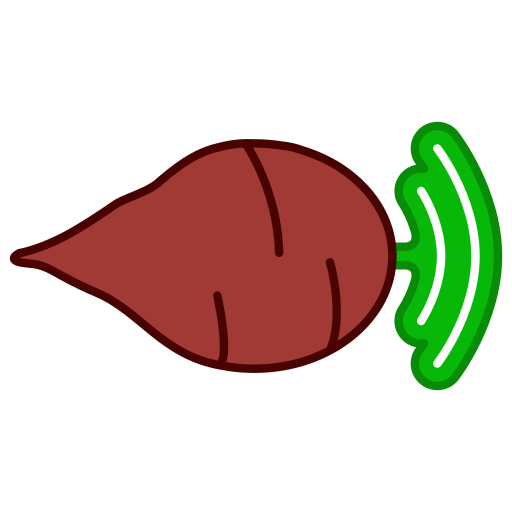

<br />

<div align="center">

  <a href="https://github.com/FlorentLM/BeetstreamNext">
    
  </a>

<h3 align="center">BeetstreamNext</h3>
  <p>
  A modern, feature-rich OpenSubsonic API server for your Beets.io music library.
  <br/>

[](https://opensource.org/licenses/MIT)  

  </p>
</div>


BeetstreamNext is a fork of Beetstream, a [Beets.io](https://beets.io) plugin that exposes [OpenSubsonic API endpoints](https://opensubsonic.netlify.app/docs/opensubsonic-api/), allowing you to stream your Beets library.

I started implementing new features to Beetstream but ended up rewriting a significant part of it, so I figured it'd make more sense to keep it as a distinct project.
The goal is to cover all of the modern OpenSubsonic API, with some additions. I'm getting there :)

Personally, I use Beets to manage my music library but I don't like to write metadata to the files. So with this, I can have the best of both worlds.

## Key Features

-   **Extensive API coverage**: Implements a wide range of OpenSubsonic endpoints, soon to cover everything.
-   **On-the-fly transcoding**: As in the original project, this uses **FFmpeg** to transcode audio in real-time to your desired bitrate. Direct streaming is also supported.
-   **Full cover art support**: Serves artwork from multiple sources:
    -   Local album art path from your Beets library
    -   Fallback to the [Cover Art Archive](https://coverartarchive.org/) using MusicBrainz IDs
    -   Fetches and caches artist images from the [Deezer API](https://developers.deezer.com/api)
    -   Extracts embedded artwork directly from media files
-   **Dynamic Playlist management**:
    -   Reads `.m3u` playlists from specified directories
    -   Supports creating and deleting playlists directly through the API
    -   Integrates with Beets' native `playlist` and `smartplaylist` plugins
-   **Rich metadata integration**: Fetches optional artist info like biographies, top tracks, and similar artists from the [Last.fm API](https://www.last.fm/api)

-   **COMING SOON: Multi-user support**: Dedicated SQLite database to manage users, ratings, bookmarks, and starred content (full multi-user endpoints are in development)
-   **COMING SOON: Actual authentication**: User credentials, encryption at rest

## Installation

Requires Python 3.9.1 or newer.

> [!NOTE]
> BeetstreamNext is not yet available on PyPI. Installation currently requires cloning the source code from GitHub.

[//]: # (### For Users)

1.  **Install Beets**: If you haven't already, [install and configure Beets](https://beets.readthedocs.io/en/stable/guides/main.html). You will also need `git` installed on your system.

2.  **Clone the BeetstreamNext Repository**:
    ```bash
    git clone https://github.com/FlorentLM/BeetstreamNext.git
    cd BeetstreamNext
    ```

3.  **Install the Plugin**:
    From inside the `BeetstreamNext` directory, run the installation command. You can use `pip` or any modern installer like `uv`.
    ```bash
    pip install .
    ```
    For transcoding, you will also need to have **FFmpeg** installed and available in your system's PATH.

4.  **Enable the Plugin**: Add `beetstreamnext` to the `plugins` section of your Beets config file (`~/.config/beets/config.yaml`):
    ```yaml
    plugins: beetstreamnext
    ```

5.  **Run the Server**:
    ```bash
    beet beetstreamnext
    ```

[//]: # (### For Developers)

[//]: # ()
[//]: # (If you want to contribute to BeetstreamNext, the setup process uses [Poetry]&#40;https://python-poetry.org/&#41; for dependency management.)

[//]: # ()
[//]: # (1.  **Clone the repository**:)

[//]: # (    ```bash)

[//]: # (    git clone https://github.com/FlorentLM/BeetstreamNext.git)

[//]: # (    cd BeetstreamNext)

[//]: # (    ```)

[//]: # ()
[//]: # (2.  **Install dependencies**:)

[//]: # (    This will create a virtual environment and install all required packages for development and testing.)

[//]: # (    ```bash)

[//]: # (    poetry install)

[//]: # (    ```)

[//]: # ()
[//]: # (3.  **Activate the environment**:)

[//]: # (    ```bash)

[//]: # (    poetry shell)

[//]: # (    ```)

[//]: # ()
[//]: # (4.  **Run the server**:)

[//]: # (    From inside the activated shell, you can run the plugin directly.)

[//]: # (    ```bash)

[//]: # (    beet beetstreamnext)

[//]: # (    ```)

[//]: # (See the [**CONTRIBUTING.md**]&#40;./CONTRIBUTING.md&#41; file for more details on running tests and submitting changes.)

## Configuration

You can configure BeetstreamNext in your Beets `config.yaml` file. Here are the available options with their default values:

```yaml
beetstreamnext:
  host: 0.0.0.0
  port: 8080
  never_transcode: False        # Never re-encode files, even if a client requests it.
  
  # Artist Image Handling
  fetch_artists_images: True    # Fetch artist photos from Deezer when a client requests them.
  save_artists_images: True     # Save fetched artist photos to their respective folders.

  # Playlist Configuration
  playlist_dirs:                # A list of directories to scan for .m3u playlists.
    - '/path/to/my/playlists'
    - '/another/path/for/playlists'
```

### Environment Variables

Some features require API keys or secrets, which should be configured as environment variables for security. You can place these in a `.env` file in the directory where you run the `beet` command.

[//]: # (-   **`BEETSTREAMNEXT_KEY` &#40;Required for User features&#41;**: A unique encryption key for storing user data. You can generate one by running this Python command:)

[//]: # (    ```bash)

[//]: # (    python -c "from cryptography.fernet import Fernet; print&#40;Fernet.generate_key&#40;&#41;.decode&#40;&#41;&#41;")

[//]: # (    ```)

-   **`LASTFM_API_KEY` (Optional)**: Your API key from Last.fm to enable fetching artist bios, top tracks, and similar songs.
    ```
    LASTFM_API_KEY="your_lastfm_api_key_here"
    ```

## Client Configuration

### Authentication

The backend for a full, multi-user authentication system is under active development. For now, **you can use any username and password** in your client to connect to the server. The server will respond as a default "admin" user.

### Server and Port

Connect your client to the server's IP address and the configured port (default is `8080`). For example: `http://192.168.1.10:8080`.

## Supported Clients

BeetstreamNext aims for broad compatibility with any Subsonic-compliant player. It has been successfully tested with the following clients:

#### Android
- [Symfonium](https://symfonium.app/)
- [Tempo](https://github.com/CappielloAntonio/tempo)
- [SubTune](https://github.com/TaylorKunZhang/SubTune)
- [substreamer](https://substreamerapp.com/)
- [Ultrasonic](https://gitlab.com/ultrasonic/ultrasonic)

#### Desktop
- [Supersonic](https://github.com/dweymouth/supersonic)

## Roadmap

This project is under active development. Here is a high-level overview of planned features and missing endpoints.

#### Core Features (In Progress)
-   [ ] Finalize BeetstreamNext's database storage for multi-user data
-   [ ] Implement a complete, secure authentication and user management system
-   [ ] Create a Docker image

#### Missing API Endpoints
These endpoints require the database and user management systems to be fully operational:
- `getUsers`, `createUser`, `updateUser`, `deleteUser`
- `changePassword`
- `updatePlaylist`
- `getAvatar`
- `star`, `unstar`, `setRating`
- `getBookmarks`, `createBookmark`, `deleteBookmark`

#### Future API Endpoints
- `getLyrics`
- `getPlayQueue`, `savePlayQueue`
- `getScanStatus`, `startScan`

#### Video, Radio & Podcast Endpoints
These are lower priority but may be considered in the future.
- `getVideos`, `getVideoInfo`, `hls`, `getCaptions`
- `getPodcasts`, `getNewestPodcasts`, etc.
- `getInternetRadioStations` and related endpoints.

#### Social Endpoints
- `getNowPlaying`
- `getShares`, `createShare`, `updateShare`, `deleteShare`
- `jukeboxControl`
- `getChatMessages`, `addChatMessage`

## License

This project is licensed under the MIT License. See the `LICENSE` file for details.